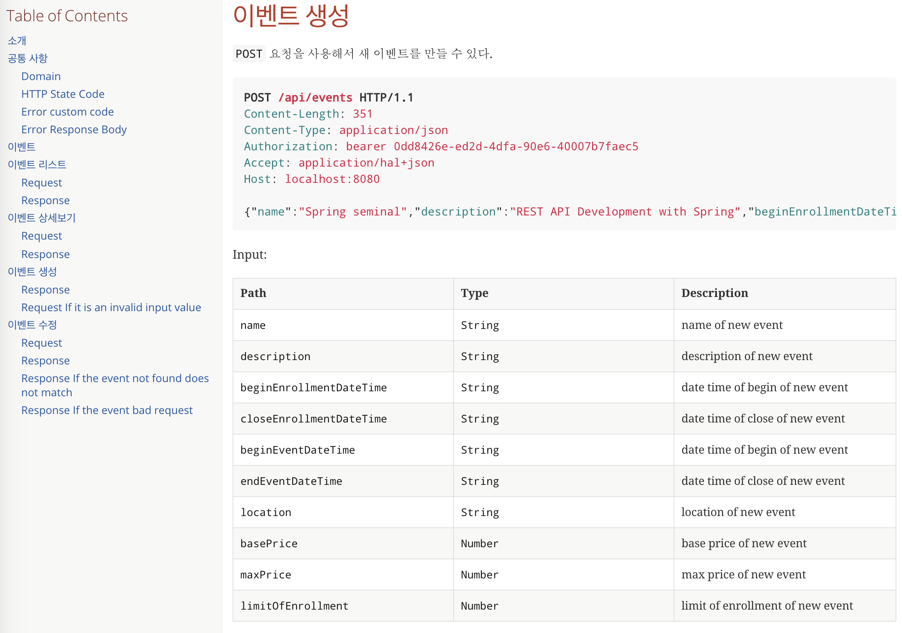
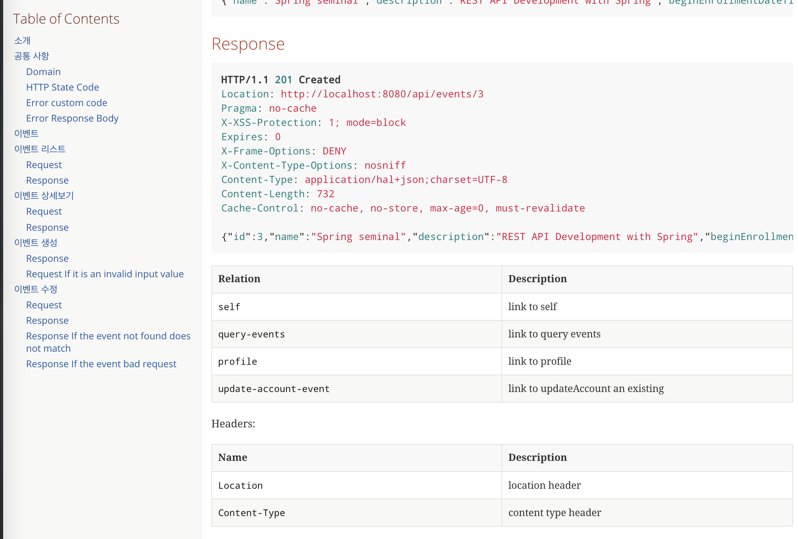
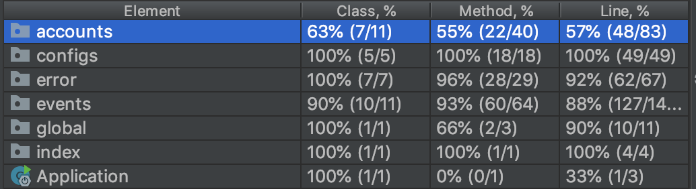

# Event REST API [](https://travis-ci.org/juyoungyoo/spring-boot-rest-api)





> [그런 REST API로 괜찮은가?](https://tv.naver.com/v/2292653)를 보고 RESTful API에 관심을 갖게되어 시작한
프로젝트입니다. 
현 프로젝트는 Self-descriptive 


### 개발환경
- JDK 1.8
- SpringBoot 2.1.3.RELEASE
- Gradle 5.2.1  
- JPA

- PostgreSQL(dev)
- H2 (local, test)

- Spring Security
- Spring HATEOAS
- Spring AOP
- Spring RestDocs

- Lombok
- Embedded Tomcat
- TEST : JUnit 5, MockMVC, AssertJ

### 목표
- Spring Security OAuth2으로 인증 처리
- Self-Descriptive Message, HATEOAS 만족하는 REST API 개발
- 성능 확인을 위해 모든 요청에 대하여 응답까지 걸리는 시간을 log 로 기록

### DB modeling
// todo 


### 폴더 구조
```
.
+-- configs
+-- index
+-- accounts
    +-- password
+-- events
    +-- period  
+-- error
+-- global
    +-- converter
```
  
----

#### 암호화
비밀번호 암호화는 bcrypt 암호화를 사용

#### 예외처리
비즈니스 로직에 집중하기 위해 Exception 발생 시, ControllerAdvice 으로 공통화 처리
 
#### 로깅
- 모든 요청의 대한 응답 시간은 Spring AOP로 처리
- 로그 파일 위치 : `./logs`

#### 문서화
테스트 코드 기반으로 만들어 주기 때문에 테스트 코드가 강제된다는 장점이 있는 RestDocs 사용      
[참고](./docs/index.html)

#### 테스트 커버리지
